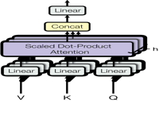
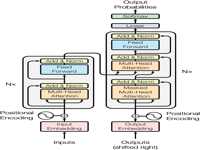
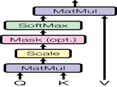

# litesearch


<!-- WARNING: THIS FILE WAS AUTOGENERATED! DO NOT EDIT! -->

> **NB** Reading this on GitHub? The formatted
> [documentation](https://Karthik777.github.io/litesearch/) is nicer.

`litesearch` puts **full-text search + SIMD vector search** in a single
SQLite database with automatic **Reciprocal Rank Fusion (RRF)**
reranking — no server, no new infra, no heavy dependencies.

<table>
<colgroup>
<col style="width: 50%" />
<col style="width: 50%" />
</colgroup>
<thead>
<tr>
<th>Module</th>
<th>What you get</th>
</tr>
</thead>
<tbody>
<tr>
<td><code>litesearch</code> (core)</td>
<td><a
href="https://Karthik777.github.io/litesearch/core.html#database"><code>database()</code></a>
· <code>get_store()</code> · <code>db.search()</code> · <a
href="https://Karthik777.github.io/litesearch/core.html#rrf_merge"><code>rrf_merge()</code></a>
· <code>vec_search()</code></td>
</tr>
<tr>
<td><code>litesearch.data</code></td>
<td>PDF extraction · Python code chunking · FTS query preprocessing</td>
</tr>
<tr>
<td><code>litesearch.utils</code></td>
<td>ONNX text encoders (<a
href="https://Karthik777.github.io/litesearch/utils.html#fastencode"><code>FastEncode</code></a>)
· <a
href="https://Karthik777.github.io/litesearch/data.html#images_to_pdf"><code>images_to_pdf</code></a>
· <code>images_to_markdown</code></td>
</tr>
</tbody>
</table>

## Install

``` python
# usearch SQLite extensions are configured automatically on first import
# (macOS needs one extra step — see litesearch.postfix)
!uv add litesearch
```

## Quick Start

Search your documents in eight lines of code:

``` python
from litesearch import *
from model2vec import StaticModel
import numpy as np
```

``` python
enc   = StaticModel.from_pretrained("minishlab/potion-retrieval-32M")  # fast static embeddings
db    = database()          # SQLite + usearch SIMD extensions loaded
store = db.get_store()      # table with FTS5 index + embedding column

texts = ["attention is all you need",
         "transformers replaced recurrent networks",
         "gradient descent minimises the loss"]
embs  = enc.encode(texts)   # float32, shape (3, 512)
store.insert_all([dict(content=t, embedding=e.ravel().tobytes()) for t, e in zip(texts, embs)])

q = "self-attention mechanism"
db.search(q, enc.encode([q]).ravel().tobytes(), columns=['id','content'], dtype=np.float32, quote=True)
```

    /Users/71293/code/litesearch/.venv/lib/python3.13/site-packages/tqdm/auto.py:21: TqdmWarning: IProgress not found. Please update jupyter and ipywidgets. See https://ipywidgets.readthedocs.io/en/stable/user_install.html
      from .autonotebook import tqdm as notebook_tqdm

    [{'rowid': 1,
      'id': 1,
      'content': 'attention is all you need',
      '_dist': 0.7910182476043701,
      '_rrf_score': 0.016666666666666666},
     {'rowid': 3,
      'id': 3,
      'content': 'gradient descent minimises the loss',
      '_dist': 0.9670860767364502,
      '_rrf_score': 0.01639344262295082},
     {'rowid': 2,
      'id': 2,
      'content': 'transformers replaced recurrent networks',
      '_dist': 1.0227680206298828,
      '_rrf_score': 0.016129032258064516}]

``` python
[{'rowid': 1, 'id': 1, 'content': 'attention is all you need',
  '_dist': 0.134, '_rrf_score': 0.0328},
 {'rowid': 2, 'id': 2, 'content': 'transformers replaced recurrent networks',
  '_dist': 0.264, '_rrf_score': 0.0161},
 {'rowid': 3, 'id': 3, 'content': 'gradient descent minimises the loss',
  '_dist': 0.482, '_rrf_score': 0.0161}]
```

> `_rrf_score` is the fused rank score (higher = better). `_dist` is the
> cosine distance from the vector search leg.

## Core API

### [`database()`](https://Karthik777.github.io/litesearch/core.html#database) — SQLite + SIMD

[`database()`](https://Karthik777.github.io/litesearch/core.html#database)
returns a [fastlite](https://fastlite.answer.ai/) `Database` patched
with usearch’s SIMD distance functions. Pass a file path for
persistence; omit it for an in-memory store.

``` python
db = database()   # ':memory:' by default; use database('my.db') for persistence
db.q('select sqlite_version() as sqlite_version')
```

    [{'sqlite_version': '3.52.0'}]

The usearch extension adds SIMD-accelerated distance functions directly
into SQL. Four metrics are available: `cosine`, `sqeuclidean`, `inner`,
and `divergence`. All variants support `f32`, `f16`, `f64`, and `i8`
suffixes.

``` python
vecs = dict(
    v1=np.ones((100,),  dtype=np.float32).tobytes(),   # ones
    v2=np.zeros((100,), dtype=np.float32).tobytes(),   # zeros
    v3=np.full((100,), 0.25, dtype=np.float32).tobytes()  # 0.25s (same direction as v1)
)
def dist_q(metric):
    return db.q(f'''
        select
            distance_{metric}_f32(:v1,:v2) as {metric}_v1_v2,
            distance_{metric}_f32(:v1,:v3) as {metric}_v1_v3,
            distance_{metric}_f32(:v2,:v3) as {metric}_v2_v3
    ''', vecs)

for fn in ['sqeuclidean', 'divergence', 'inner', 'cosine']: print(dist_q(fn))
```

    [{'sqeuclidean_v1_v2': 100.0, 'sqeuclidean_v1_v3': 56.25, 'sqeuclidean_v2_v3': 6.25}]
    [{'divergence_v1_v2': 34.657352447509766, 'divergence_v1_v3': 12.046551704406738, 'divergence_v2_v3': 8.66433334350586}]
    [{'inner_v1_v2': 1.0, 'inner_v1_v3': -24.0, 'inner_v2_v3': 1.0}]
    [{'cosine_v1_v2': 1.0, 'cosine_v1_v3': 0.0, 'cosine_v2_v3': 1.0}]

> Cosine distance between v1 (ones) and v3 (0.25s) is **0.0** — they
> point in the same direction. Both `inner` and `divergence` are also
> available for different retrieval trade-offs.

### `get_store()` — FTS5 + Embedding Table

`db.get_store()` creates (or opens) a table with a `content` TEXT
column, an `embedding` BLOB column, a JSON `metadata` column, and an
FTS5 full-text index that stays in sync automatically via triggers.

``` python
store = db.get_store()   # idempotent — safe to call multiple times
store.schema
```

    'CREATE TABLE [store] (\n   [content] TEXT NOT NULL,\n   [embedding] BLOB,\n   [metadata] TEXT,\n   [uploaded_at] FLOAT DEFAULT CURRENT_TIMESTAMP,\n   [id] INTEGER PRIMARY KEY\n)'

Pass `hash=True` to use a **content-addressed id** (SHA-1 of the
content). Useful for code search and deduplication — re-inserting the
same content is a no-op:

``` python
code_store = db.get_store(name='code', hash=True)
code_store.insert_all([
    dict(content='hello world', embedding=np.ones( (100,), dtype=np.float16).tobytes()),
    dict(content='hi there', embedding=np.full( (100,), 0.5, dtype=np.float16).tobytes()),
    dict(content='goodbye now', embedding=np.zeros((100,), dtype=np.float16).tobytes()),
], upsert=True, hash_id='id')
code_store(select='id,content')
```

    [{'id': '250ce2bffa97ab21fa9ab2922d19993454a0cf28', 'content': 'hello world'},
     {'id': 'c89f43361891bfab9290bcebf182fa5978f89700', 'content': 'hi there'},
     {'id': '882293d5e5c3d3e04e8e0c4f7c01efba904d0932', 'content': 'goodbye now'}]

### `db.search()` — Hybrid FTS + Vector with RRF

`db.search()` runs **both** an FTS5 keyword query and a vector
similarity search, then merges the ranked lists with Reciprocal Rank
Fusion. Documents that appear in *both* lists get a score boost — the
best of both worlds.

``` python
# Re-create a clean store for the search demo
db2  = database()
st2  = db2.get_store()

phrases = [
    "attention mechanisms in neural networks",
    "transformer architecture for sequence modelling",
    "stochastic gradient descent and learning rate schedules",
    "positional encoding and token embeddings",
    "dropout regularisation reduces overfitting",
]
# use float32 vectors (matching dtype= below)
vecs2 = [np.random.default_rng(i).random(64, dtype=np.float32) for i in range(len(phrases))]
st2.insert_all([dict(content=p, embedding=v.tobytes()) for p, v in zip(phrases, vecs2)])
```

    <Table store (content, embedding, metadata, uploaded_at, id)>

``` python
q2 = "attention"
q_vec = np.random.default_rng(42).random(64, dtype=np.float32).tobytes()
db2.search(q2, q_vec, columns=['id','content'], dtype=np.float32)
```

    [{'rowid': 1,
      'id': 1,
      'content': 'attention mechanisms in neural networks',
      'rank': -1.116174474454989,
      '_rrf_score': 0.032539682539682535},
     {'rowid': 3,
      'id': 3,
      'content': 'stochastic gradient descent and learning rate schedules',
      '_dist': 0.20330411195755005,
      '_rrf_score': 0.016666666666666666},
     {'rowid': 2,
      'id': 2,
      'content': 'transformer architecture for sequence modelling',
      '_dist': 0.23124444484710693,
      '_rrf_score': 0.01639344262295082},
     {'rowid': 5,
      'id': 5,
      'content': 'dropout regularisation reduces overfitting',
      '_dist': 0.23238885402679443,
      '_rrf_score': 0.016129032258064516},
     {'rowid': 4,
      'id': 4,
      'content': 'positional encoding and token embeddings',
      '_dist': 0.32342469692230225,
      '_rrf_score': 0.015625}]

Pass `rrf=False` to see the raw FTS and vector legs separately — handy
for debugging relevance:

``` python
db2.search(q2, q_vec, columns=['id','content'], dtype=np.float32, rrf=False)
```

    {'fts': [{'id': 1,
       'content': 'attention mechanisms in neural networks',
       'rank': -1.116174474454989}],
     'vec': [{'id': 3,
       'content': 'stochastic gradient descent and learning rate schedules',
       '_dist': 0.20330411195755005},
      {'id': 2,
       'content': 'transformer architecture for sequence modelling',
       '_dist': 0.23124444484710693},
      {'id': 5,
       'content': 'dropout regularisation reduces overfitting',
       '_dist': 0.23238885402679443},
      {'id': 1,
       'content': 'attention mechanisms in neural networks',
       '_dist': 0.24136507511138916},
      {'id': 4,
       'content': 'positional encoding and token embeddings',
       '_dist': 0.32342469692230225}]}

> **Tip — dtype matters.** Always pass the same `dtype` used when
> encoding. `model2vec` and most ONNX models return `float32`; pass
> `dtype=np.float32`. The default is `float16` (matches
> [`FastEncode`](https://Karthik777.github.io/litesearch/utils.html#fastencode)).

> **Tip — custom schemas.** `get_store()` is a convenience. For custom
> schemas, call `db.t['my_table'].vec_search(emb, ...)` and
> `rrf_merge(fts_results, vec_results)` directly.

## `litesearch.data`

### Query Preprocessing

FTS5 is powerful, but raw natural-language queries often miss results.
`litesearch.data` ships helpers to transform queries before sending them
to FTS:

``` python
q = 'This is a sample query'
print('preprocessed q with defaults: `%s`' % pre(q))
print('keywords extracted: `%s`'          % pre(q, wc=False, wide=False))
print('q with wild card: `%s`'            % pre(q, extract_kw=False, wide=False, wc=True))
```

    preprocessed q with defaults: `sample* OR query*`
    keywords extracted: `sample query`
    q with wild card: `This* is* a* sample* query*`

<table>
<thead>
<tr>
<th>Function</th>
<th>What it does</th>
</tr>
</thead>
<tbody>
<tr>
<td><code>clean(q)</code></td>
<td>strips <code>*</code> and returns <code>None</code> for empty
queries</td>
</tr>
<tr>
<td><code>add_wc(q)</code></td>
<td>appends <code>*</code> to each word for prefix matching</td>
</tr>
<tr>
<td><code>mk_wider(q)</code></td>
<td>joins words with <code>OR</code> for broader matching</td>
</tr>
<tr>
<td><code>kw(q)</code></td>
<td>extracts keywords via YAKE (removes stop-words)</td>
</tr>
<tr>
<td><code>pre(q)</code></td>
<td>applies all of the above in one call</td>
</tr>
</tbody>
</table>

### PDF Extraction

`litesearch.data` patches `pdf_oxide.PdfDocument` with bulk
page-extraction methods. All methods take optional `st` / `end` page
indices and return a fastcore `L` list:

<table>
<colgroup>
<col style="width: 50%" />
<col style="width: 50%" />
</colgroup>
<thead>
<tr>
<th>Method</th>
<th>Returns</th>
</tr>
</thead>
<tbody>
<tr>
<td><code>doc.pdf_texts(st, end)</code></td>
<td>plain text per page</td>
</tr>
<tr>
<td><code>doc.pdf_markdown(st, end)</code></td>
<td>markdown with headings + tables detected</td>
</tr>
<tr>
<td><code>doc.pdf_links(st, end)</code></td>
<td>URI strings extracted from annotations</td>
</tr>
<tr>
<td><code>doc.pdf_tables(st, end)</code></td>
<td>structured rows / cells / bbox dicts</td>
</tr>
<tr>
<td><code>doc.pdf_spans(st, end)</code></td>
<td>text spans with font size, weight, bbox</td>
</tr>
<tr>
<td><code>doc.pdf_images(st, end, output_dir)</code></td>
<td>image metadata, or save to disk</td>
</tr>
</tbody>
</table>

``` python
doc = PdfDocument('pdfs/attention_is_all_you_need.pdf')
print(f'{doc.page_count()} pages, {len(doc.pdf_links())} links')

# plain text of page 1
doc.pdf_texts(0, 1)[0][:300]
```

    15 pages, 18 links

    'Provided proper attribution is provided, Google hereby grants permission to\nreproduce the tables and figures in this paper solely for use in journalistic or\nscholarly works.\n\n\nAttention Is All You Need\n\n\n∗\n∗\n∗\n∗\nAshish Vaswani Noam Shazeer Niki Parmar Jakob Uszkoreit\nGoogle Brain Google Brain Google'

    15 pages, 44 links

``` python
'Abstract\nThe dominant sequence transduction models are based on complex recurrent...'
```

``` python
# markdown export — headings and tables are detected automatically
md = doc.pdf_markdown()
print(f'Page 1 (markdown):\n{md[0][:400]}')
```

    Page 1 (markdown):
    # arXiv:1706.03762v7  [cs.CL]  2 Aug 2023

    Provided proper attribution is provided, Google hereby grants permission to reproduce the tables and figures in this paper solely for use in journalistic or scholarly works.

    ## Attention Is

    ## All

    ## You Need

    ∗∗**Ashish Vaswani****Noam Shazeer****Niki Parmar** Google BrainGoogle BrainGoogle Research [avaswani@google.com](mailto:avaswani@google.com)[no

    Page 1 (markdown):
    # arXiv:1706.03762v7  [cs.CL]  2 Aug 2023

    Provided proper attribution is provided, Google hereby grants permission
    to reproduce the tables and figures in this paper solely for use in
    journalistic or scholarly works...

### Code Ingestion

[`pyparse`](https://Karthik777.github.io/litesearch/data.html#pyparse)
splits a Python file or string into top-level code chunks (functions,
classes, assignments) with source location metadata — ready to insert
into a store:

``` python
txt = """
from fastcore.all import *
a=1
class SomeClass:
    def __init__(self,x): store_attr()
    def method(self): return self.x + a
"""
pyparse(code=txt)
```

    [{'content': 'a=1', 'metadata': {'path': None, 'uploaded_at': None, 'name': None, 'type': 'Assign', 'lineno': 3, 'end_lineno': 3}}, {'content': 'class SomeClass:\n    def __init__(self,x): store_attr()\n    def method(self): return self.x + a', 'metadata': {'path': None, 'uploaded_at': None, 'name': 'SomeClass', 'type': 'ClassDef', 'lineno': 4, 'end_lineno': 6}}]

[`pkg2chunks`](https://Karthik777.github.io/litesearch/data.html#pkg2chunks)
indexes an **entire installed package** in one call — great for building
a semantic code-search store over your dependencies:

``` python
chunks = pkg2chunks('fastlite')
print(f'{len(chunks)} chunks from fastlite')
chunks.filter(lambda d: d['metadata']['type'] == 'FunctionDef')[0]
```

    51 chunks from fastlite

    {'content': 'def t(self:Database): return _TablesGetter(self)',
     'metadata': {'path': '/Users/71293/code/litesearch/.venv/lib/python3.13/site-packages/fastlite/core.py',
      'uploaded_at': 1771806134.9519145,
      'name': 't',
      'type': 'FunctionDef',
      'lineno': 44,
      'end_lineno': 44,
      'package': 'fastlite',
      'version': '0.2.4'}}

    47 chunks from fastlite

``` python
{'content': 'def t(self:Database): return _TablesGetter(self)',
 'metadata': {'path': '.../fastlite/core.py',
              'name': 't', 'type': 'FunctionDef',
              'lineno': 44, 'end_lineno': 44,
              'package': 'fastlite', 'version': '0.2.4'}}
```

## `litesearch.utils`

### [`FastEncode`](https://Karthik777.github.io/litesearch/utils.html#fastencode) — ONNX Text Encoder

[`FastEncode`](https://Karthik777.github.io/litesearch/utils.html#fastencode)
wraps any ONNX model from HuggingFace Hub. It handles tokenisation,
batching, optional parallel thread-pool execution, and runtime int8
quantization — all without PyTorch or Transformers.

<table>
<colgroup>
<col style="width: 25%" />
<col style="width: 25%" />
<col style="width: 25%" />
<col style="width: 25%" />
</colgroup>
<thead>
<tr>
<th>Config</th>
<th>Model</th>
<th>Dim</th>
<th>Notes</th>
</tr>
</thead>
<tbody>
<tr>
<td><code>embedding_gemma</code> (default)</td>
<td><code>onnx-community/embeddinggemma-300m-ONNX</code></td>
<td>768</td>
<td>Strong retrieval, ~300M params</td>
</tr>
<tr>
<td><code>modernbert</code></td>
<td><code>nomic-ai/modernbert-embed-base</code></td>
<td>768</td>
<td>BERT-style, fast</td>
</tr>
<tr>
<td><code>nomic_text_v15</code></td>
<td><code>nomic-ai/nomic-embed-text-v1.5</code></td>
<td>768</td>
<td>Shares embedding space with <code>nomic_vision_v15</code></td>
</tr>
</tbody>
</table>

`encode_document` and `encode_query` apply the model’s prompt templates
automatically.

``` python
texts = [
    'Attention is all you need',
    'The transformer architecture uses self-attention',
    'BERT pretrains on masked language modeling',
    'GPT uses autoregressive generation',
]

# Default model — downloads once, cached
enc      = FastEncode()
doc_embs = enc.encode_document(texts)
q_emb    = enc.encode_query(['what paper introduced transformers?'])
print('doc shape:', doc_embs.shape, 'dtype:', doc_embs.dtype)  # (4, 768) float16

# Batching + parallel thread-pool
enc_fast = FastEncode(batch_size=2, parallel=2)
embs     = enc_fast.encode_document(texts)

# Runtime int8 quantization — creates model_int8.onnx on first run, reused after
enc_q = FastEncode(quantize='int8')
embs  = enc_q.encode_document(texts)
```

    doc shape: (4, 768) dtype: float16
    Encoding setup errored out with exception: No module named 'onnx'
    ONNX session not initialized. Fix error during initialisation

    doc shape: (2, 768) dtype: float16

### [`FastEncodeImage`](https://Karthik777.github.io/litesearch/utils.html#fastencodeimage) — ONNX Image Encoder

[`FastEncodeImage`](https://Karthik777.github.io/litesearch/utils.html#fastencodeimage)
encodes images with CLIP-style ONNX vision models. No Transformers
dependency — preprocessing (resize → normalise → CHW) is done with PIL +
NumPy using config stored in the model dict.

<table>
<colgroup>
<col style="width: 25%" />
<col style="width: 25%" />
<col style="width: 25%" />
<col style="width: 25%" />
</colgroup>
<thead>
<tr>
<th>Config</th>
<th>Model</th>
<th>Dim</th>
<th>Notes</th>
</tr>
</thead>
<tbody>
<tr>
<td><code>nomic_vision_v15</code> (default)</td>
<td><code>nomic-ai/nomic-embed-vision-v1.5</code></td>
<td>768</td>
<td>Same space as <code>nomic_text_v15</code></td>
</tr>
<tr>
<td><code>clip_vit_b32</code></td>
<td><code>Qdrant/clip-ViT-B-32-vision</code></td>
<td>512</td>
<td>Classic CLIP</td>
</tr>
</tbody>
</table>

Accepts PIL Images, file paths, or raw bytes — any mix.

### [`FastEncodeMultimodal`](https://Karthik777.github.io/litesearch/utils.html#fastencodemultimodal) — Cross-Modal Image + Text Search

[`FastEncodeMultimodal`](https://Karthik777.github.io/litesearch/utils.html#fastencodemultimodal)
wraps a model repo that ships both text and vision ONNX encoders in a
single shared embedding space — a text query can retrieve images
directly. Below: index *Attention Is All You Need* (text chunks +
figures) then search for `'attention mechanism diagram'`.

**Unified model** — `siglip2_so400m` (~800 MB, one download):

``` python
import json, base64, io
from PIL import Image
from IPython.display import display
```

``` python
enc = FastEncodeMultimodal(siglip2_so400m)   # single unified model, ~800 MB, cached on first run
doc = PdfDocument('pdfs/attention_is_all_you_need.pdf')
db  = database()
ts, ims = db.get_store('texts'), db.get_store('images')

for pg, ci, chunk, emb in encode_pdf_texts(doc, enc.text):
    ts.insert(dict(content=chunk, embedding=emb.tobytes(), metadata=json.dumps({'page': pg})))
for pg, img_bytes, emb in encode_pdf_images(doc, enc.vision):
    ims.insert(dict(content=f'page_{pg}', embedding=emb.tobytes(),
                    metadata=json.dumps({'page': pg, 'data': base64.b64encode(img_bytes).decode()})))

q = 'attention mechanism diagram'
q_emb = enc.text.encode([q])[0].tobytes()
txt_r = ts.db.search(pre(q), q_emb, table_name='texts', columns=['content']) or []
img_r = ims.vec_search(q_emb)
for r in rrf_merge(txt_r, img_r)[:6]:
    print(f"rrf={r['_rrf_score']:.4f}  {r['content'][:70]}")
    meta = json.loads(r.get('metadata', '{}'))
    if 'data' in meta:
        display(Image.open(io.BytesIO(base64.b64decode(meta['data']))).resize((200, 150)))
```

**Paired models** — `nomic_text_v15` + `nomic_vision_v15` share the same
768-dim space; use
[`FastEncode`](https://Karthik777.github.io/litesearch/utils.html#fastencode)
and
[`FastEncodeImage`](https://Karthik777.github.io/litesearch/utils.html#fastencodeimage)
separately:

``` python
enc_text = FastEncode(nomic_text_v15)
enc_img  = FastEncodeImage(nomic_vision_v15)
db2  = database()
ts2, ims2 = db2.get_store('texts'), db2.get_store('images')

for pg, ci, chunk, emb in encode_pdf_texts(doc, enc_text):
    ts2.insert(dict(content=chunk, embedding=emb.tobytes(), metadata=json.dumps({'page': pg})))
for pg, img_bytes, emb in encode_pdf_images(doc, enc_img):
    ims2.insert(dict(content=f'page_{pg}', embedding=emb.tobytes(),
                     metadata=json.dumps({'page': pg, 'data': base64.b64encode(img_bytes).decode()})))

q_emb2 = enc_text.encode([q])[0].tobytes()
txt_r2 = ts2.db.search(pre(q), q_emb2, table_name='texts', columns=['content']) or []
img_r2 = ims2.vec_search(q_emb2)
for r in rrf_merge(txt_r2, img_r2)[:6]:
    print(f"rrf={r['_rrf_score']:.4f}  {r['content'][:70]}")
    meta = json.loads(r.get('metadata', '{}'))
    if 'data' in meta:
        display(Image.open(io.BytesIO(base64.b64decode(meta['data']))).resize((200, 150)))
```

    rrf=0.0167  Self-attention, sometimes called intra-attention is an attention mecha
    rrf=0.0167  page_3



    rrf=0.0164  Attention mechanisms have become an integral part of compelling sequen
    rrf=0.0164  page_2



    rrf=0.0161  2,[19]. Inall but a few cases27],[ however, such attention mechanisms
    rrf=0.0161  page_3



    rrf=0.0167  Self-attention, sometimes called intra-attention is an attention mecha
    rrf=0.0167  page_3


    rrf=0.0164  Attention mechanisms have become an integral part of compelling sequen
    rrf=0.0164  page_2


    rrf=0.0161  2,[19]. Inall but a few cases27],[ however, such attention mechanisms
    rrf=0.0161  page_3


## Ideas for More Delight (Planned)

Things that would make litesearch even smoother to use:

<table>
<colgroup>
<col style="width: 50%" />
<col style="width: 50%" />
</colgroup>
<thead>
<tr>
<th>Idea</th>
<th>Why it helps</th>
</tr>
</thead>
<tbody>
<tr>
<td><strong><code>Retriever</code> class</strong> — bundles encoder + db
into <code>r.search(q)</code></td>
<td>removes the manual encode → bytes → search boilerplate</td>
</tr>
<tr>
<td><strong><code>ingest(texts, encoder, store)</code>
helper</strong></td>
<td>one-liner for embed-and-insert loops</td>
</tr>
<tr>
<td><strong>Auto dtype detection</strong></td>
<td><code>search()</code> could infer dtype from stored embedding size,
removing the <code>dtype=np.float32</code> footgun</td>
</tr>
<tr>
<td><strong><code>from_pdf(path, encoder)</code> /
<code>from_dir(dir, encoder)</code></strong></td>
<td>index a PDF or folder in one call</td>
</tr>
<tr>
<td><strong>Rich / tabulate display for results</strong></td>
<td>pretty-print search results in notebooks</td>
</tr>
<tr>
<td><strong>Metadata filter sugar</strong> —
<code>filters={'source': 'doc.pdf'}</code></td>
<td>cleaner than writing raw SQL <code>where</code> strings</td>
</tr>
<tr>
<td><strong>CLI</strong> — <code>litesearch index &lt;dir&gt;</code> /
<code>litesearch search &lt;q&gt;</code></td>
<td>quick ad-hoc search without writing Python</td>
</tr>
</tbody>
</table>

## Next Steps

- **[examples/01_simple_rag.ipynb](examples/01_simple_rag.ipynb)** —
  ingest a folder of PDFs, chunk with chonkie, rerank with FlashRank
- **[examples/02_tool_use.ipynb](examples/02_tool_use.ipynb)** — wire
  litesearch into an LLM tool-use loop
- **[core docs](https://Karthik777.github.io/litesearch/core.html)** —
  full API reference for
  [`database`](https://Karthik777.github.io/litesearch/core.html#database),
  `get_store`, `search`,
  [`rrf_merge`](https://Karthik777.github.io/litesearch/core.html#rrf_merge),
  `vec_search`
- **[data docs](https://Karthik777.github.io/litesearch/data.html)** —
  PDF methods,
  [`pyparse`](https://Karthik777.github.io/litesearch/data.html#pyparse),
  [`pkg2chunks`](https://Karthik777.github.io/litesearch/data.html#pkg2chunks),
  query preprocessing
- **[utils docs](https://Karthik777.github.io/litesearch/utils.html)** —
  [`FastEncode`](https://Karthik777.github.io/litesearch/utils.html#fastencode),
  [`download_model`](https://Karthik777.github.io/litesearch/utils.html#download_model),
  image tools

## Acknowledgements

A big thank you to [@yfedoseev](https://github.com/yfedoseev) for
[pdf-oxide](https://github.com/yfedoseev/pdf-oxide), which powers the
PDF extraction functionality in `litesearch.data`.
